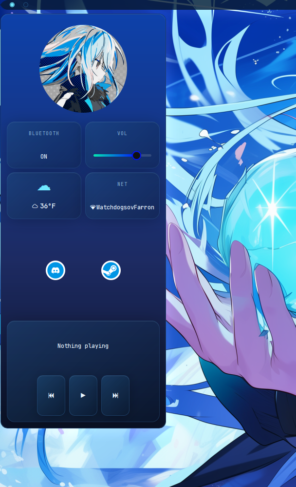
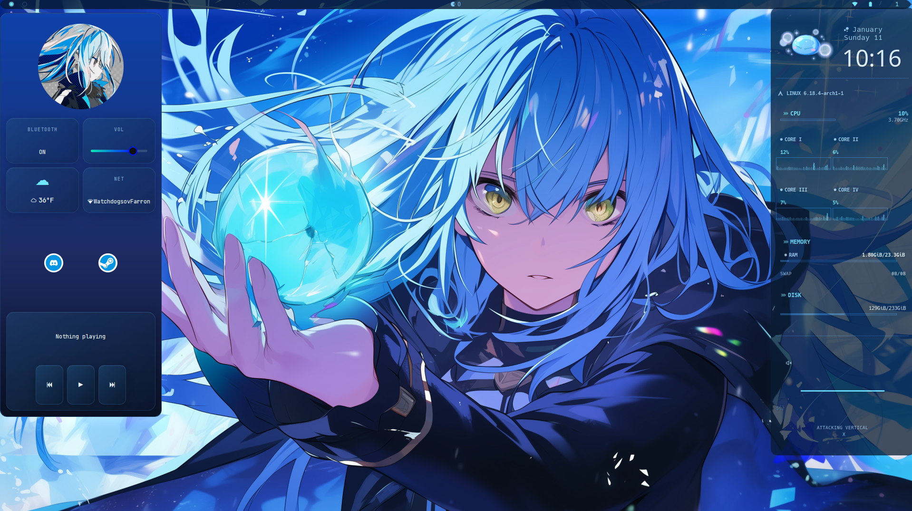

# [[ [[ ✩ DOTS BY DIZZY ✩ ]]]]

Eww Sidebar [ with a blue theme ]

[Designed to be toggled open/closed from my Polybar]

Contains a user image at the top, and a grid layout of cards
displaying [from left to right]

Bluetooth, Volume, Weather, and Network. 

A floating quickapps section below that displays Discord and Steam.

The bottom contains an mrpis music player.

Eww Quickapp Icons included in repo, steam.svg & discord.svg

**EWW REPO:**
[Eww Repo Git Clone](https://github.com/elkowar/eww)

**EWW DOCUMENTATION:**
[Official Documentation](https://elkowar.github.io/eww/)

_Required_

:light_blue_heart: Eww

:light_blue_heart: Steam

:light_blue_heart: Discord

:light_blue_heart: Mpris Music Player

:light_blue_heart: Polybar

:light_blue_heart: Nerd Fonts - Jetbrains Mono & SF Pro Display Font

:blue_heart: OR - change out Discord & Steam to your own desired quickapps. 

Keep in mind that the current layout is using .svg images for the quickapps.

Your own music player can be configured as well, but Mpris pulls from any audio source!

Additionally, you can change the taskbar from Polybar to another Eww, or whatever you would like to toggle it open with !

[ I am using Linux Archcraft & i3wm ]

